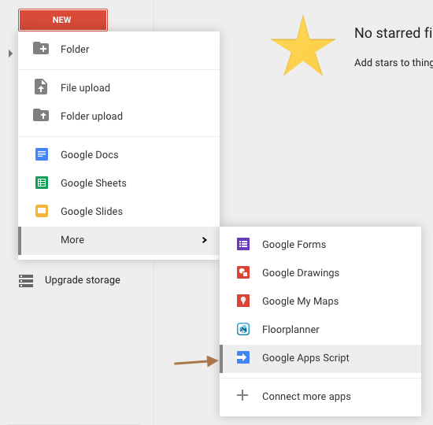
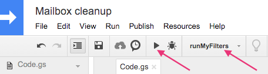
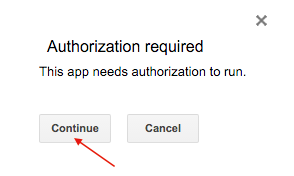
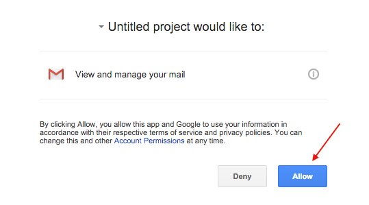
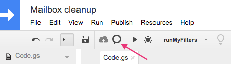
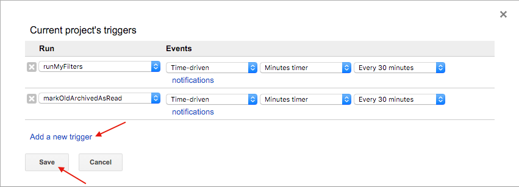

# google-mail-delayed-cleanup
Google app script to automatically cleanup your google mail box in a delayed fashion

## This is how get this running:

1. Open your Google Drive

2. Click *New* -> *More* -> *Google App Script*:

   

3. Name your script and paste the code from Github

4. Edit your filters as desired

5. Select *runMyFilters* and press *Play* button to test run the script:

   

6. Click *Continue* on the authorization required notice:

   

7. Allow the app to view and manage your mail:

   

8. Edit your triggers pressing the *Clock* button:

   

9. Add some triggers as pictured:

   

10. That's it!
